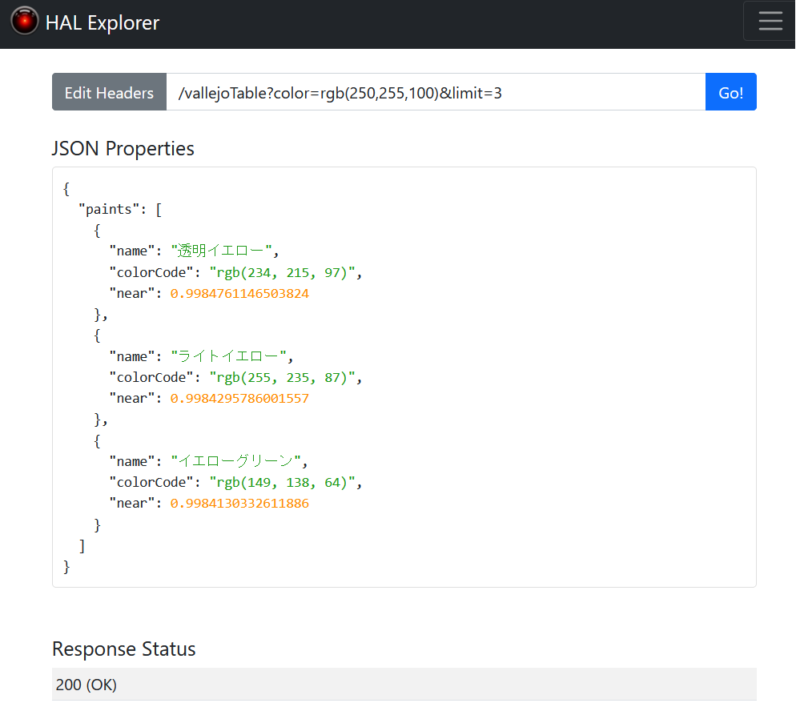

# Spring BootやGitHubの使い方を学ぶための学習用プロジェクト

## 概要
使用したい色（rgb）を入力すると、その色に最も近いファレホ塗料を検索します。

塗料の情報はファレホ公式サイトを参照

https://hobby.volks.co.jp/brand/vallejo/

## 使用技術
1. APLサーバー
   - 言語: Java
   - フレームワーク: Spring Boot
2. DBサーバー
   - PostgreSQL
3. 環境構築
   - Docker
   - Visual Studio Code + Remote Containers

## 補足
- 現時点ではサーバーサイドの機能のみ実装（将来的にクライアントも実装予定）
- 動作確認にはSpring Data REST HAL Browserを使用
